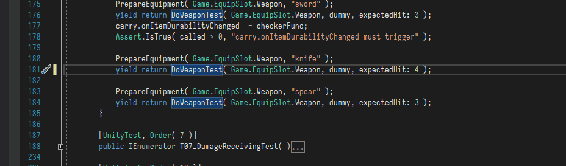

# EnumeratorCallAnalyzer
A Roslyn analyzer that catch wrong Unity coroutine call.

It will catch

    Coroutine( );
    
If Coroutine is function defined with

    IEnumerator Coroutine( ) { ... }
    
And will attempt to change to

    yield return Coroutine( );
    

